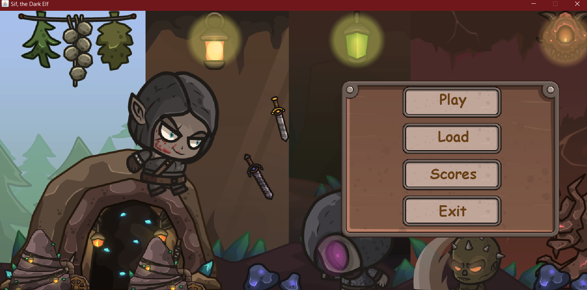
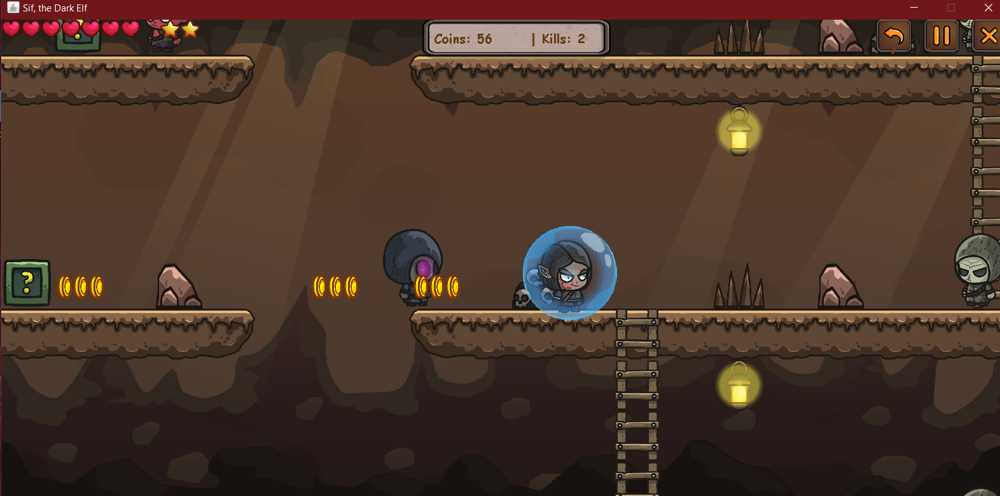
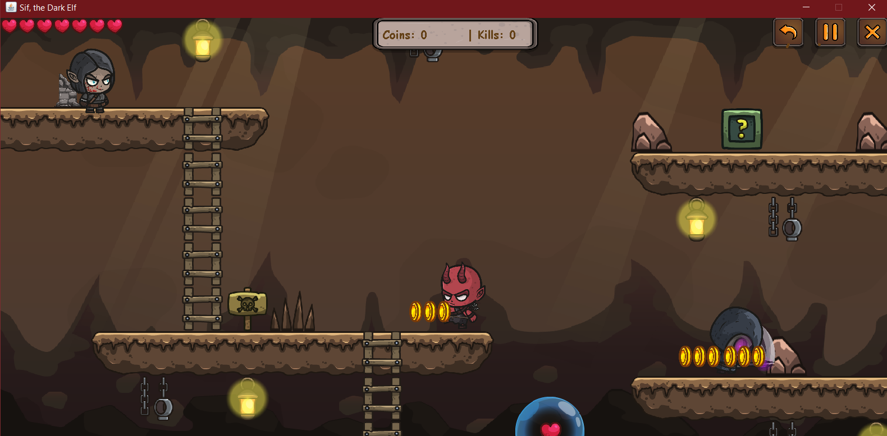
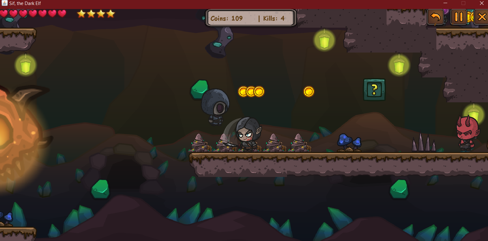
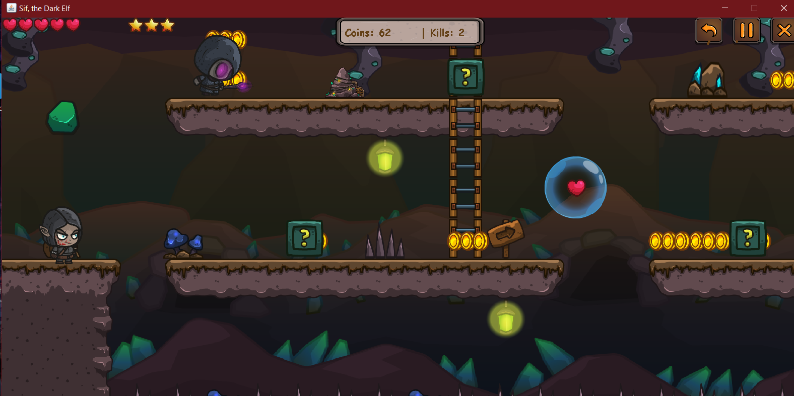
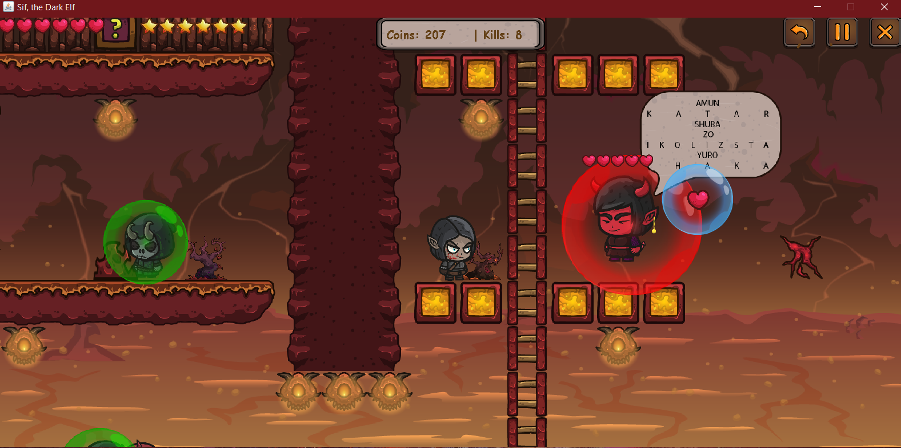
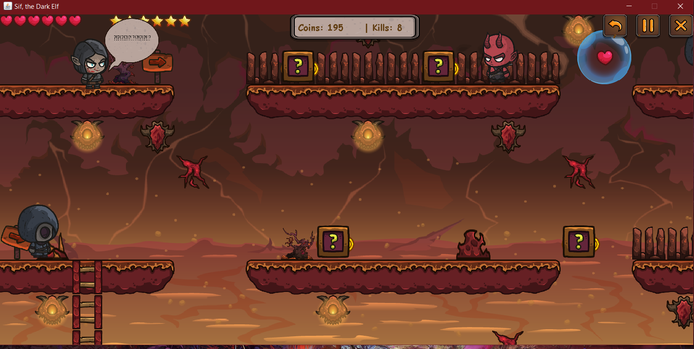

# Sif, the Dark Elf - Java Platformer Game

## README

### Introduction
Welcome to "Sif, the Dark Elf," an exciting Java platformer game that plunges you into a thrilling adventure across three challenging levels. In this game, you'll guide Sif through intricate levels, facing off against demonic foes and powerful mages using her trusty sword. Your objective is to collect stars, slash through boxes and demons, all while staying alive in this perilous journey. Sif can also collect special bubbles that grant her temporary invincibility, enhancing her survival chances. Keep an eye out for ladders throughout the game, enabling Sif to climb and navigate her way to victory!

### Interfaces
1. **Menu**
   - The starting point of the game, where players can access various options such as starting a new game, loading a saved game, viewing the scoreboard, or exiting the game.
   -    

2. **Level 1: Stone Cave**
   - The initial level where players embark on their journey through a case. Navigate through challenging obstacles and enemies to progress to the next level.
     
  

3. **Level 2: Caverns of Mystery**
   - Delve into the dark depths of mysterious caverns filled with puzzles and dangers. This level presents increased difficulty to test the player's skills.
     
  

4. **Level 3: Throne of Shakshuka**
   - The ultimate challenge awaits in the throne room. Prepare for an intense boss battle that will push your gaming prowess to the limits.
   
  

5. **Scoreboard**
   - Check your progress and scores in the game. Access this feature to view your achievements.

6. **Save & Load**
   - Begin or continue your adventure. Access this feature to start a new game or load a previously saved game and continue your journey.

### Functionality
- **SQL Design Patterns**
  - The game utilizes SQL design patterns to  manage game data, including player progress, scores, and saved games.
  
- **HD Assets**
  - "Sif, the Dark Elf" incorporates high-definition assets to enhance the gaming experience.

### Development Environment
- **IDE**: IntelliJ IDEA Ultimate
- **Languages**: Java

### How to Run the Game
1. Open the project in IntelliJ IDEA Ultimate.
2. Build and run the project to start the game.
3. Use the menu to navigate through levels, load saved games, view the scoreboard, and engage in epic boss fights.

Thank you for playing "Sif, the Dark Elf." We hope you enjoy the adventure and challenge that awaits!
